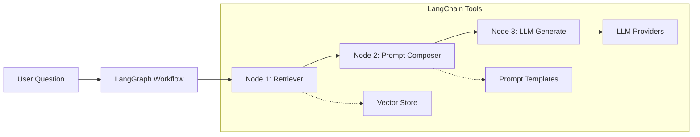

# Agentic Workflow Development Notes

## 1. Core Dependencies Installed

| Package                          | Purpose                                                            | Why We Chose It                                                                                      |
| -------------------------------- | ------------------------------------------------------------------ | ---------------------------------------------------------------------------------------------------- |
| `langgraph`                      | Orchestrates multi-step, conditional workflows (the “brain”).      | Provides a declarative graph-based API that is clearer than imperative code for complex agent flows. |
| `langchain` & `langchain-openai` | Helper abstractions for LLM calls, prompt management, and tooling. | Battle-tested ecosystem with many ready connectors.                                                  |
| `sentence-transformers`          | Generates dense embeddings for Hindi & English text.               | High-quality multilingual models, easy integration with FAISS.                                       |
| `faiss-cpu`                      | Vector similarity search engine.                                   | Fast, pure-CPU option that works well on Windows & avoids SQLite issues.                             |

> **Note**: We initially tried `chromadb`, but it failed on Windows because of an outdated system SQLite (`< 3.35.0`). Switching to FAISS removed this blocker and kept setup simple.

## 2. Vector Databases 101: What, Why & Our Choice

### 2.1 What is a Vector Database?

A **vector database** stores information as high-dimensional vectors instead of rows & columns.  
Each vector encodes the **meaning** of a chunk of data (text, image, audio).  
It specialises in **similarity search**: “find me items whose meaning is close to this query”.

**Analogy:** If traditional databases are like phone books (you look up exactly ‘Alice’), a vector DB is like a playlist-recommendation engine ("give me songs that _feel_ similar to this one").

| Property  | Traditional DB (e.g., MongoDB)                 | Vector DB (e.g., FAISS, Pinecone)                                |
| --------- | ---------------------------------------------- | ---------------------------------------------------------------- |
| Data type | Structured docs / JSON                         | Dense vectors (lists of floats)                                  |
| Indexing  | B-tree / hash indexes → exact or range matches | ANN indexes (HNSW, IVF, PQ…) → **approximate nearest neighbour** |
| Query     | “Where `user_id = 42`”                         | “Vectors within 0.2 cosine distance of query vector”             |
| Use-cases | CRUD apps, transaction logs                    | Semantic search, recommendation, RAG for LLMs                    |

### 2.2 Why Do We Need One?

LLMs are _stateless_; to ground their answers we feed them context (RAG).

1. Convert every textbook paragraph into a vector.
2. Convert learner’s current query/topic into a vector.
3. **Similarity search** → grab top-K passages.
4. Inject those passages into the prompt so the LLM cites real material, not guesses.

Without a vector DB we’d rely on brittle keyword search ("capital" vs "राजधानी") and lose semantic matches and synonyms.

### 2.3 Why FAISS vs. MongoDB for Vectors?

MongoDB is great for structured JSON but **slow & memory-heavy** for high-dimensional vector math.

- No efficient ANN algorithms out-of-the-box.
- Would require external search add-ons (Atlas Search) that still lag pure vector engines.

**FAISS** is purpose-built (by Facebook AI Research) for vector similarity:

- C++ core → blazing fast on CPU.
- Multiple index types; we start with `IndexFlatIP` (cosine) for simplicity.
- Zero extra services: just writes an index file → easy local dev & CI.

> In our system MongoDB continues to store _who_ watched _which_ video, while FAISS answers _what content_ is semantically relevant right now.

### 2.4 Where We’re Using It

We built `knowledge_base.py` to:

1. **build_index(docs)** – embed → store in FAISS.
2. **similarity_search(query)** – return `(passage, score)` pairs.
   The Retriever node will call `similarity_search()` every time the learner answers a question to pull fresh, level-appropriate context.

---

## 2.5 Vector Database Decision Rationale

1. **Technical Compatibility**
   - **FAISS** has no external DB engine dependency ➜ painless on Windows.
   - **ChromaDB** required SQLite ≥ 3.35 which is non-trivial to upgrade on Win10.
2. **Performance**
   - FAISS is highly optimized for similarity search and supports millions of vectors.
3. **Ecosystem Support**
   - LangChain ships built-in FAISS wrappers → minimal boilerplate.
4. **Future Flexibility**
   - If we later move to a managed vector store (Pinecone, Weaviate, etc.) the abstraction layer in LangChain lets us swap easily.

---

##Steps:

1. **Create Knowledge Base**
   - Extract textbook/book content ➜ generate embeddings ➜ store in FAISS index.
2. **Define LangGraph Nodes**
   - _Retriever Node_: fetch relevant chunks from FAISS.
   - _Performance Analyzer Node_: read user progress from MongoDB.
   - _Prompt Composer Node_: build augmented prompts for DeepSeek.
3. **Wire Nodes into a Graph**
   - Conditional edges based on analyzer output (e.g., adjust difficulty).
4. **Expose Graph Behind New API Endpoint**
   - e.g., `POST /guided/start-session/<video_id>/`.

---

## End-to-End Workflow

> **End-to-End Snapshot**  
> **Goal defined** → **Planner** activates workflow (LangGraph) → **Memory** supplies user history & book chunks (MongoDB + FAISS) via **Tools** (LangChain wrappers) → **Planner** composes prompt (LangChain `PromptTemplate`) → **Reasoning Engine** (DeepSeek via LangChain `ChatOpenAI`) produces output → **Result** saved back to **Memory** → **Planner** decides next step.

| Workflow Stage                           | Technology                            | What It Does & Why We Chose It                                                                                                                                                                                            |
| ---------------------------------------- | ------------------------------------- | ------------------------------------------------------------------------------------------------------------------------------------------------------------------------------------------------------------------------- |
| **Planner**                              | **LangGraph**                         | Orchestrates the conversation/learning flow as a _directed graph_. Each node is a “step” (e.g. retrieve context, analyze performance). Conditional edges let us branch based on user accuracy or confidence.              |
| **Memory – Long-Term (structured data)** | **MongoDB**                           | Stores transcripts, curated videos, user progress, etc. No change here—just read/write as usual via existing `mongo_service`.                                                                                             |
| **Memory – Long-Term (semantic)**        | **FAISS** + **sentence-transformers** | Keeps vector embeddings of textbook/book passages. Enables **semantic search** so we can fetch the most relevant chunk for any learner query. We replaced ChromaDB with FAISS because it is lighter and Windows-friendly. |
| **Tools Layer**                          | **LangChain**                         | Provides ready-made wrappers that let LangGraph nodes call:                                                                                                                                                               |

• FAISS vector search (`FAISS.from_documents`, `.similarity_search`)  
 • DeepSeek chat completion (`ChatOpenAI`)  
 • Prompt templating & output parsers. |
| **Prompt Composer** | **LangChain PromptTemplate** | Builds the final prompt string that feeds DeepSeek: system text + retrieved book chunk + conversation context + user question. |
| **Reasoning Engine** | **DeepSeek LLM** (accessed through LangChain) | Generates adaptive questions, explanations, or corrections. LangChain gives us a unified API that feels like OpenAI. |
| **Performance Analyzer Node** | **Python Logic + MongoDB** | Reads user stats (`user_learning_progress` collection) and returns metrics (accuracy %, streaks etc.) to LangGraph so edges can branch (e.g. _if accuracy < 50% → easier question_). |
| **Retriever Node** | **FAISS + sentence-transformers** | Converts the learner’s _current topic_ into an embedding, does a similarity search, and returns top-k book passages. |
| **Memory Update** | **MongoDB / FAISS** | After DeepSeek responds, we:  
 • Save the interaction to `user_learning_progress`  
 • (Optionally) store new embeddings if the learner adds notes/question. |

### Key Concepts

1. **Vector Embedding**  
   Turning a text chunk into a list of numbers that captures its meaning. Similar meanings → nearby points in high-dimensional space.

2. **Semantic Search**  
   Instead of keyword matching, we search for _meaning_. We embed the query, look for nearby vectors in FAISS, and get passages that “feel” related.

3. **Retriever-Augmented Generation (RAG)**  
   We _retrieve_ a relevant passage (FAISS) and _augment_ the LLM prompt with it. The model can then answer with grounded, factual info instead of hallucinating.

4. **Graph-Based Orchestration**  
   Traditional code calls functions in sequence (A → B → C). **LangGraph** lets us draw a flowchart: nodes are steps, arrows are conditions. Much easier to reason about adaptive flows.

5. **Branching on Performance**  
   After each answer we compute accuracy. LangGraph edge can say _if accuracy ≥ 80% → go to harder node; else → repeat easier practice_. That’s how the tutor “adapts”.

---

## 3. Retriever-Augmented Generation (RAG) – The Heart of Personalised Answers

### What is RAG?

RAG = **Retriever + Generator**.

1. **Retriever** finds snippets of real knowledge relevant to the query.
2. **Generator** (LLM) reads those snippets and crafts the final answer.

### Why RAG instead of Pure LLM?

| Challenge      | Pure LLM                   | RAG Advantage                   |
| -------------- | -------------------------- | ------------------------------- |
| Hallucinations | Invents facts              | Provides grounded citations     |
| Token Limits   | Large prompts blow up cost | Only inject _relevant_ passages |
| Domain Updates | Needs model fine-tune      | Just add new docs to vector DB  |

### Our Planned RAG Workflow

```
Learner Question/Topic
        │
        ▼
Sentence-Transformers → embed query (vector) ───►  FAISS Index  (semantic search) ─┐
                                                                               │ top-k passages
                                                                               ▼
LangChain PromptTemplate  ── builds final prompt (system + passages + question) ─►
                                                                               │
                                                                               ▼
DeepSeek Chat Completion  ── generates answer / next question ───►  LangGraph Node
                                                                               │
                                                                               ▼
MongoDB  ←── store result & update user progress ────► LangGraph decides next step
```

### Technologies in Each Step

| Step               | Tech                                            | Details                                                         |
| ------------------ | ----------------------------------------------- | --------------------------------------------------------------- |
| Embed Query & Docs | `sentence-transformers`                         | Model: `paraphrase-multilingual-MiniLM-L12-v2`(Hindi + English) |
| Vector Store       | **FAISS**                                       | `IndexFlatIP` (cosine) for fast top-k search                    |
| Retrieval API      | `knowledge_base.similarity_search()`            | Abstracts FAISS details                                         |
| Prompt Build       | **LangChain** `PromptTemplate`                  | Template slots: `{system}`, `{context}`, `{user}`               |
| Generation         | **DeepSeek** via LangChain `ChatOpenAI` wrapper | Temperature tuned per node                                      |
| Orchestration      | **LangGraph**                                   | Nodes: `Retriever → PromptComposer → LLM → Analyzer`            |
| Memory             | **MongoDB** + optional FAISS updates            | Stores interactions + allows future personalised retrieval      |

### Where We Are Today

- **Retriever & Vector DB** implemented (`knowledge_base.py`).
- **PromptComposer & LangGraph graph** coming next.

### Notes:

1. _“How do you prevent hallucinations?”_  
   → We use RAG: every DeepSeek prompt is grounded with top-k textbook passages chosen via FAISS. Model can’t invent what’s not in context.
2. _“How does the system stay fresh?”_  
   → New learning materials are embedded and added to the FAISS index; no retraining necessary – RAG instantly starts using them.
3. _“Why not store vectors in MongoDB?”_  
   → Mongo is optimised for key/value; FAISS provides sub-millisecond ANN search with cosine distance, critical for real-time UX.

---

## 4. Knowledge Base & Retriever

### 4.1 What We Built

**How the FAISS Index Gets Built**

1. At startup (or via a maintenance script) we call `knowledge_base.build_index(docs, rebuild=True)` where `docs` is a list of textbook paragraphs.
2. The function:
   - Ensures the `faiss_store/` folder exists.
   - Embeds every paragraph with `sentence-transformers` → numpy array.
   - Creates a FAISS `IndexFlatIP` and adds all vectors.
   - Writes two artefacts to disk:
     • `faiss.index` – binary representation of the vector index
     • `documents.pkl` – pickled list of original texts (so we can map id → text)
3. Subsequent runs of the app just call `load_index()` which memory-maps the index in milliseconds (no re-embedding).

**Why We Need the Index**
• Embedding every textbook paragraph at query-time would be far too slow (seconds).  
• A persisted FAISS file lets us answer similarity queries in <20 ms on CPU.  
• Keeps RAM usage low—only vector data is loaded, not full model weights each time.

1. **Package**: `backend/agentic_workflow`
2. **Modules**: `knowledge_base.py`, `retriever.py`, `workflow.py`
   - Uses **Sentence-Transformers** (`paraphrase-multilingual-MiniLM-L12-v2`) to embed text (handles Hindi + English).
   - Stores vectors in a **FAISS** index (`IndexFlatIP`) for cosine similarity.
   - Persists both index (`faiss.index`) and original docs (`documents.pkl`) under `backend/agentic_workflow/faiss_store/` so we don’t rebuild every time.
   - Exposes:
     ```python
     build_index(documents: List[str], rebuild=False)
     load_index() -> (faiss.Index, List[str])
     similarity_search(query: str, top_k=3) -> List[(doc, score)]
     ```
   - • `retriever.py` defines `retrieve_context(state)` LangGraph node that injects `context` (top-k passages) into the workflow state.
     • `workflow.py` stitches a minimal graph: **entry → retriever → END** so we can already demo retrieval with `run_simple(query)`.
   - CLI test block confirms end-to-end embedding ➜ indexing ➜ retrieval.

### Why This Matters

| Concern                  | Solution                                                                              |
| ------------------------ | ------------------------------------------------------------------------------------- |
| **Fast semantic lookup** | FAISS returns nearest neighbours in **milliseconds** even on CPU.                     |
| **Persistence**          | Saving index to disk avoids costly re-embedding on every restart.                     |
| **Multilingual support** | Chosen model handles Hindi + English → works for textbook passages + learner queries. |

### Where It Fits in the Flow

```
Memory (semantic) ─► Retriever Node ─► Planner
└─ build_index() done at startup/cron; similarity_search() called at runtime
```

### Notes:

1. _“How do you ground the LLM on authoritative content?”_  
   → We maintain a FAISS vector store of textbook chunks; each learner query is semantically matched to top-k passages and injected into the prompt (RAG).

2. _“Why FAISS over ElasticSearch or Pinecone?”_  
   → For our current scale it’s lightweight, runs locally, no extra infra, and has lightning-fast approximate nearest neighbour search. If we need horizontal scaling later we can swap via LangChain’s abstraction layer.

3. _“How do you handle Hindi embeddings?”_  
   → We use `paraphrase-multilingual-MiniLM-L12-v2` (Hugging face sentence-transformers model: It maps sentences & paragraphs to a 384 dimensional dense vector space and can be used for tasks like clustering or semantic search.) which is trained on >50 languages and gives strong cross-lingual performance.

Next up: **LLM Node** to generate responses using DeepSeek.

### 5 Prompt Composer Node

The `prompt_composer.py` node:

1. Takes state with `query` & `context` passages
2. Builds a structured prompt:
   ```
   [SYSTEM: Be a Hindi tutor, mix Hindi/English...]
   Context:
     1. passage A
     2. passage B
   Question: {query}
   ```
3. Adds `prompt` to state for LLM node

This structure:

- Gives clear role instructions
- Numbers passages for reference
- Maintains clear section boundaries

### 5 LLM Generation Node (Implemented)

### 5.1 Performance Analyzer Node

Purpose: assess learner answers and record correctness.

Workflow impact:
retriever → composer → llm → **analyzer** → END

State updates:

- `user_answer` – learner input (supplied by /answer endpoint)
- `expected_answer` – ground-truth
- `is_correct`/`score` – analyzer output

Why now?

1. Enables adaptive difficulty in future.
2. Allows session scoring & progress tracking.
3. Keeps LangGraph node responsibilities single-purpose.

#### Design Decision: LangChain vs Direct API

We chose to use LangChain's `ChatOpenAI` wrapper instead of calling DeepSeek's API directly because:

1. **Better Integration**

   - Native compatibility with LangGraph nodes
   - Consistent message handling
   - Built-in state management

2. **Enhanced Features**

   - Automatic retries (max_retries=3)
   - Timeout handling (request_timeout=30)
   - Streaming support with callbacks
   - Easy provider switching

3. **Type Safety**

   - LangChain validates inputs/outputs
   - Proper message type handling
   - Better error messages

4. **Future Proofing**
   - Easy to swap LLM providers
   - Built-in support for new features
   - Consistent interface as we add nodes

The `llm.py` node:

1. Takes state with composed `prompt`
2. Splits into LangChain message types:
   - `SystemMessage`: Instructions part
   - `HumanMessage`: Context + question
3. Calls DeepSeek via LangChain's `ChatOpenAI`
   - Model: `deepseek-chat`
   - Temperature: 0.7 (some creativity)
   - Max tokens: 300 (reasonable length)
4. Adds `response` to state

**Why LangChain?**

- Consistent interface across LLM providers
- Built-in retry/error handling
- Easy message formatting
- Simple API key management

---

## LangGraph Cheat-Sheet & Sentence-Transformers Role

### LangGraph Essentials

| Term            | Meaning                                                                  | Our Usage                                                          |
| --------------- | ------------------------------------------------------------------------ | ------------------------------------------------------------------ |
| **StateGraph**  | Builder object where we define nodes/edges.                              | `sg = StateGraph(State)` then `add_node`, `add_edge`, `compile()`. |
| **Node**        | Callable that takes & returns a `state` dict.                            | `retrieve_context` enriches state with FAISS passages.             |
| **Edge**        | Path between nodes; can be conditional.                                  | `sg.add_edge("retriever", END)`.                                   |
| **`END`**       | Special constant from `langgraph.graph` signalling workflow termination. | Must import (`from langgraph.graph import END`).                   |
| **Entry Point** | First node executed.                                                     | `sg.set_entry_point("retriever")`.                                 |
| **State**       | Dict flowing between nodes.                                              | Keys so far: `query`, `context`. Will add `score`, etc.            |

> Pro-tip: Most graph compilation errors come from mis-typing node names or using the string "END" instead of the constant.

### Sentence-Transformers in Our Pipeline

| Aspect             | Detail                                                                                                   |
| ------------------ | -------------------------------------------------------------------------------------------------------- |
| **Purpose**        | Converts Hindi/English text → dense vectors that capture meaning.                                        |
| **Model**          | `paraphrase-multilingual-MiniLM-L12-v2` (384-dim).                                                       |
| **Why This Model** | Multilingual, small, CPU-friendly, good semantic quality.                                                |
| **Used In**        | ① `build_index()` – embed textbook chunks once. ② `similarity_search()` – embed learner query each time. |
| **Performance**    | ~25 ms per embedding on CPU; FAISS search <1 ms.                                                         |
| **Caching**        | Model weights (~470 MB) downloaded once via HuggingFace cache.                                           |

Without **Sentence-Transformers** we wouldn’t have vectors; without **LangGraph** we wouldn’t have an adaptive flow. Combined with **FAISS**, they form the Retrieval pillar of our RAG stack.

## Understanding LangChain & LangGraph: The Big Picture

### LangChain's Role

LangChain acts as our "Swiss Army Knife" for AI operations:

1. **Abstraction Layer**

   - Handles different LLM providers (OpenAI, DeepSeek, etc.) with consistent interface
   - Manages vector stores (FAISS, Chroma, etc.) uniformly
   - Standardizes prompt templates and message formats

2. **RAG Utilities**

   - Document loading & chunking
   - Embedding generation & management
   - Vector similarity search
   - Context window management

3. **Production Features**
   - Automatic retry on API failures
   - Streaming responses
   - Caching to reduce API costs
   - Memory management for chat history

### LangGraph's Role

LangGraph is like a "State Machine for AI":

1. **Workflow Management**

   - Defines clear steps (nodes) in your AI pipeline
   - Manages data flow between steps
   - Handles branching logic ("if student confused, provide more examples")

2. **State Management**
   - Keeps track of conversation/session state
   - Passes data between nodes (e.g., retrieved context → prompt composer → LLM)
   - Allows for complex decision trees

### How They Work Together



- **LangGraph** manages the overall flow (the boxes and arrows)
- **LangChain** provides the tools inside each box

### Why This Architecture Matters

1. **Modularity**

   - Easy to swap components (e.g., switch from DeepSeek to another LLM)
   - Can add new nodes without breaking existing ones
   - Test each piece independently

2. **Maintainability**

   - Clear separation of concerns
   - Each node has one job
   - State flows predictably

3. **Scalability**
   - Add complexity gradually
   - Easy to debug (see exactly which node failed)
   - Can parallelize operations

### In Our Project

We use:

- **LangChain** for:

  - FAISS vector store operations
  - DeepSeek API calls
  - Prompt management
  - Message formatting

- **LangGraph** for:
  - Orchestrating the RAG workflow
  - Managing conversation state
  - Connecting retrieval → prompting → generation

This combination gives us enterprise-grade AI capabilities while keeping our code clean and maintainable.

## Understanding Agentic AI in Our Context

### What Makes AI "Agentic"?

An AI agent typically has these characteristics:

1. **Autonomy**: Makes decisions without constant human input
2. **Goal-directed**: Works toward specific objectives
3. **Reactive**: Responds to environment changes
4. **Persistent**: Maintains state and learns from interactions
5. **Tool-using**: Can leverage different capabilities as needed

### Our Implementation: Semi-Agentic Learning Assistant

Our system is what we'd call "semi-agentic" because:

1. **Goal-Direction**

   - Clear objective: Help learner understand Hindi
   - Adapts responses based on context
   - Uses retrieved knowledge strategically

2. **State Management**

   - Tracks conversation flow through LangGraph
   - Maintains context between interactions
   - Can reference previous explanations

3. **Tool Usage**
   - Uses FAISS for knowledge retrieval
   - Employs LLM for generation
   - Manages different types of responses

#### Future Potential:

1. **Full Autonomy**

   - Currently follows a predetermined flow
   - Could evolve to choose learning paths dynamically
   - Could initiate interactions based on learner patterns

2. **Learning & Adaptation**
   - Currently doesn't modify its behavior based on success/failure
   - Could track which explanations work best
   - Could personalize based on learner history

### The "Agent" in Our System

Our agent is the orchestrator that:

1. Receives a learner's question
2. Decides what knowledge to retrieve
3. Composes appropriate prompts
4. Generates helpful responses

It's like a teaching assistant that:

- Has access to a textbook (FAISS index)
- Knows how to explain things (LLM)
- Follows a lesson plan (LangGraph workflow)
- But still needs a teacher's guidance (predetermined paths)

### Future Agentic Potential

We could make it more agentic by adding:

1. **Dynamic Path Selection**

   ```mermaid
   graph TD
      A[Student Question] --> B{Analyze Need}
      B -->|Confused| C[Provide Examples]
      B -->|Advanced| D[Deep Dive]
      B -->|Review Needed| E[Basic Review]
   ```

2. **Learning from Interactions**

   - Track successful explanations
   - Adapt to student's learning style
   - Build personalized knowledge base

3. **Proactive Assistance**
   - Suggest practice exercises
   - Identify knowledge gaps
   - Schedule review sessions
